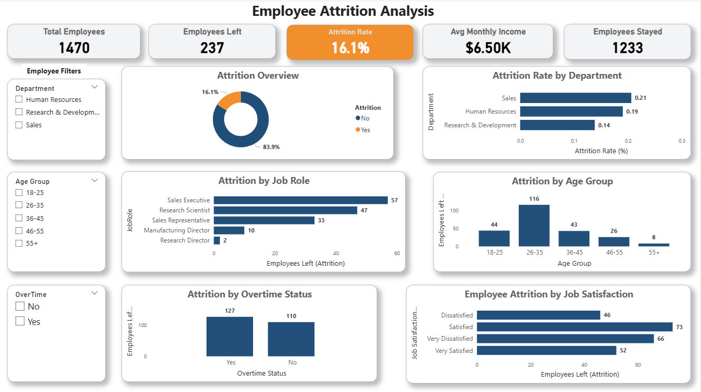
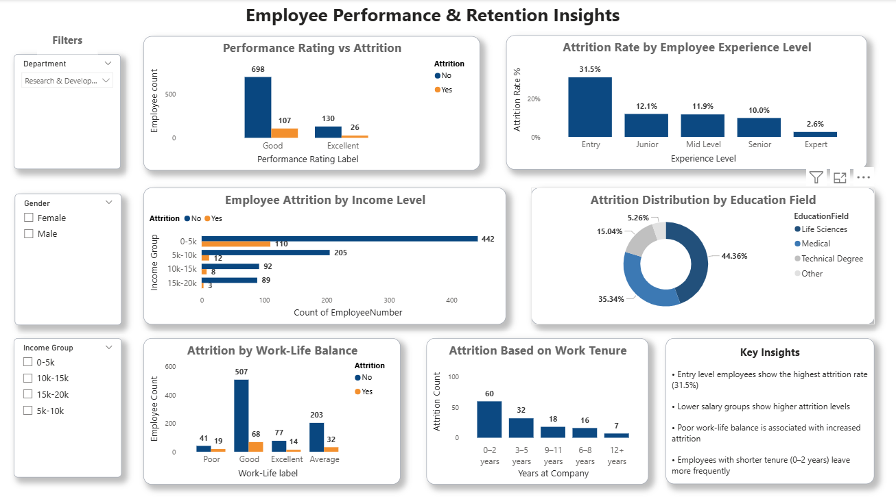

# HR Attrition Analysis

## Project Overview

Employee attrition can significantly impact organizational productivity, recruitment costs, and team stability.
This project analyzes an HR employee dataset to identify patterns and factors that influence employee turnover.
The analysis combines **Python, Excel, and Power BI** to explore attrition trends and generate actionable insights for improving employee retention.

---

## Dataset Overview

The dataset contains employee information such as demographic details, job roles, compensation, and workplace factors that may influence attrition.

**Dataset Summary**

* Total Employees: **1470**
* Employees Left: **237**
* Employees Retained: **1233**
* Overall Attrition Rate: **16.1%**

These figures indicate that while the overall retention level is relatively stable, attrition is concentrated among certain employee groups.

---

## Key Insights

* **Overtime Impact**
  Employees working overtime show noticeably higher attrition compared to those who do not, suggesting workload pressure may contribute to turnover.

* **Work-Life Balance**
  Lower work-life balance levels are associated with higher attrition, highlighting the importance of employee well-being.

* **Early-Career Attrition**
  Employees in their first **0–2 years** at the company demonstrate higher turnover compared to long-tenured employees.

* **Income Influence**
  Employees in lower income ranges show higher attrition, while higher-income groups display stronger retention.

* **Job Role & Department**
  Certain roles, particularly in **sales-related positions**, experience higher attrition compared to other departments.

---

## High-Risk Employee Profile

Based on the analysis, employees most likely to leave typically share several characteristics:

* Early-career employees with shorter tenure
* Employees working frequent overtime
* Lower income groups
* Lower job satisfaction levels
* Poor work-life balance ratings

Understanding these patterns can help organizations design targeted retention strategies.

---

## Tools & Technologies Used

* **Python** – Data cleaning and exploratory analysis
* **Pandas, Matplotlib, Seaborn** – Data analysis and visualization
* **Excel** – Pivot tables and preliminary analysis
* **Power BI** – Interactive dashboard and data visualization

---

## Project Files

- [hr_attrition_analysis.xlsx](hr_attrition_analysis.xlsx) – HR dataset used for analysis
- [hr_attrition_analysis.ipynb](hr_attrition_analysis.ipynb) – Python data analysis notebook
- [hr_attrition_dashboard.pbix](hr_attrition_dashboard.pbix) – Power BI dashboard
  
## Dashboard Preview

- 

- 
---

## Conclusion

Employee attrition is influenced by multiple interconnected factors including workload, compensation, job satisfaction, and early-career engagement.
Organizations can improve retention by focusing on **work-life balance initiatives, fair compensation structures, career development opportunities, and better workload management**.
